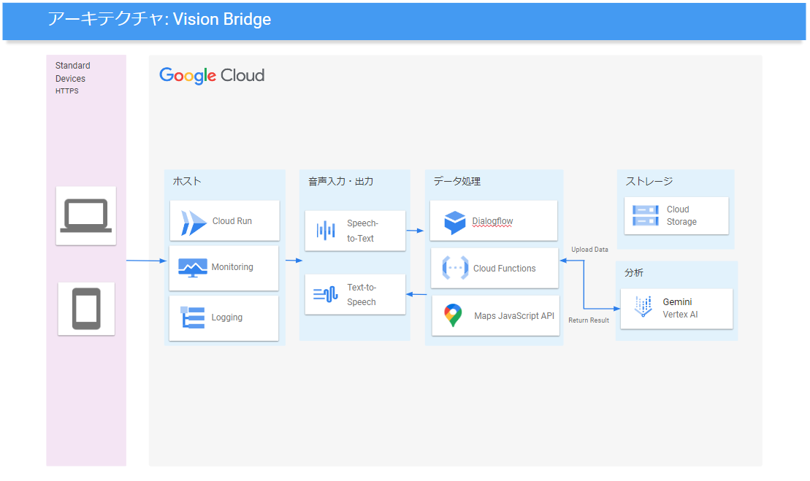

# Vision Bridge

  

Vision Bridge は、Google Cloud AI Hackathon 2024 で開発されたプロジェクトで、最新の AI 技術を活用して視覚障がい者の日常生活をサポートする革新的なアシスタントアプリケーションです。

[詳細なプロジェクト概要はこちら](ProjectOverview.md)

## 目次

- [主な機能](#主な機能)
- [技術スタック](#技術スタック)
- [セットアップ](#セットアップ)
- [使用方法](#使用方法)
- [貢献方法](#貢献方法)
- [ライセンス](#ライセンス)

## 主な機能

1. **リアルタイム環境認識**: AI による周囲の状況分析と音声フィードバック
2. **ナビゲーション支援**: 音声ガイドによる目的地までの最適ルート案内
3. **オブジェクト・テキスト認識**: 物体や文字の詳細情報を音声で提供
4. **音声コマンド操作**: 直感的な音声指示によるアプリ制御

## 技術スタック

- **フロントエンド**: Next.js, React, TypeScript
- **バックエンド**: Node.js, Express
- **AI/ML**: Google Cloud Vertex API (Gemini), Speech-to-Text, Text-to-Speech
- **自然言語処理**: DialogFlow CX (Generator 使用)
- **地図サービス**: Google Maps API
- **インフラ**: Google Cloud Platform (Cloud Run, Cloud Functions)
- **CI/CD**: Google Cloud Build

    
    
    
  

## セットアップ

1. リポジトリをクローン:

   `git clone https://github.com/yuting0624/VisionBridge.git`

2. プロジェクトディレクトリに移動:
   `cd VisionBridge`

3. 依存関係をインストール:
   `npm install`

4. 環境変数を設定:
   `cp .env.template .env`

5. ローカルでの実行:
   `npm run dev`

## 使用方法

1. アプリを起動し、音声コマンド「ヘルプ」で使用方法を確認できます。
2. カメラを起動し、周囲の環境分析を開始します。
3. 音声コマンドで目的地を設定し、ナビゲーションを開始します。

## 貢献方法

プロジェクトへの貢献を歓迎します！
新機能の提案、バグ報告、ドキュメントの改善など、どんな形での貢献も大歓迎です。

## ライセンス

このプロジェクトは MIT ライセンスの下で公開されています。詳細は[LICENSE](LICENSE)ファイルをご覧ください。

---

Vision Bridge は Google Cloud AI ハッカソンへの提出作品です。

このプロジェクトは、AI 技術を通じてより包括的な社会の実現を目指しています。
